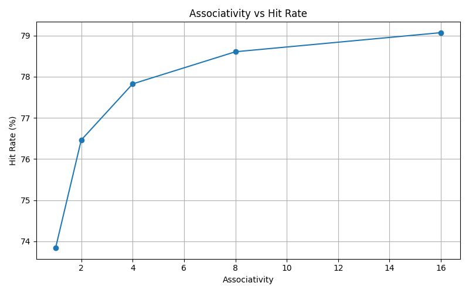
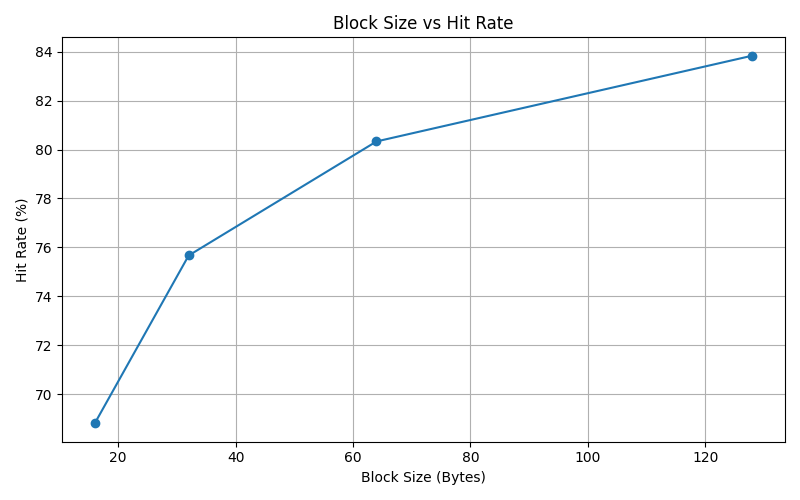
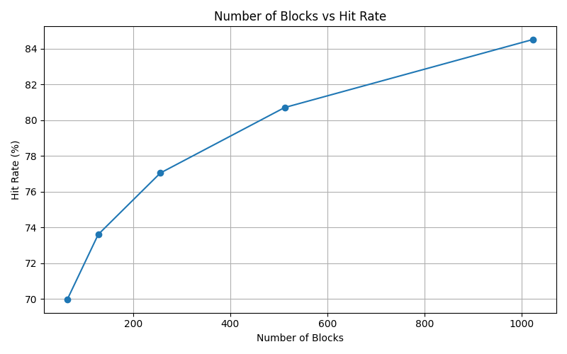
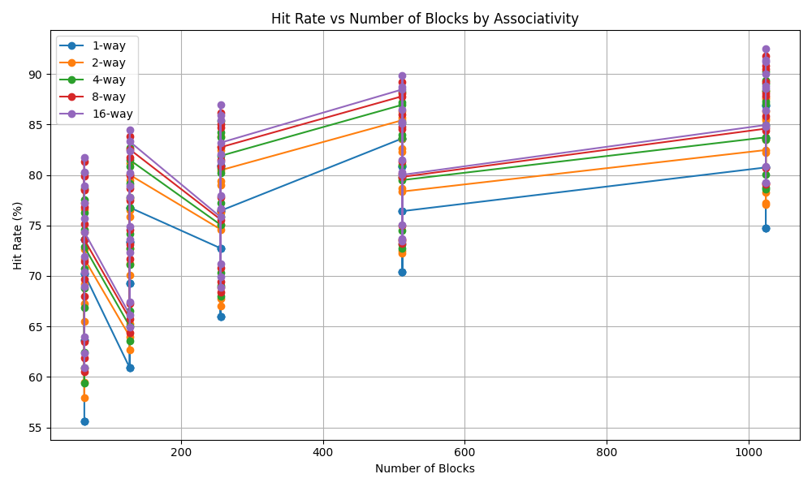
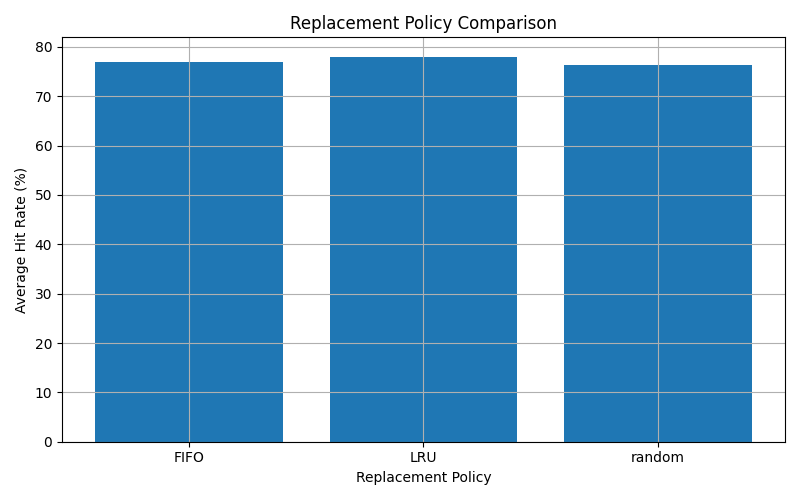
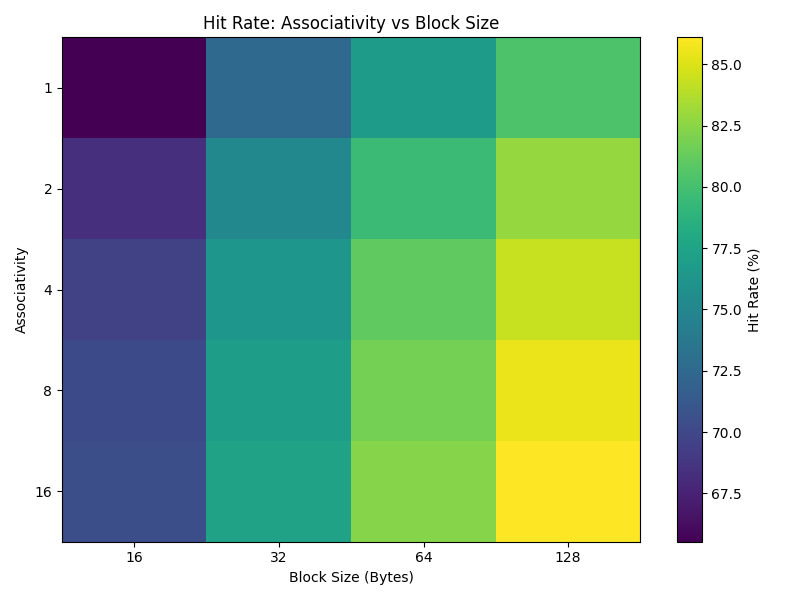
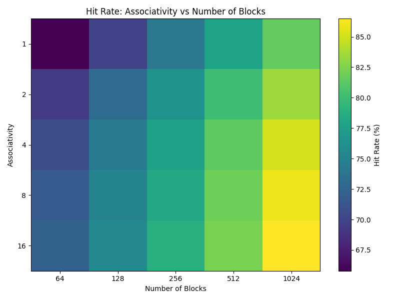
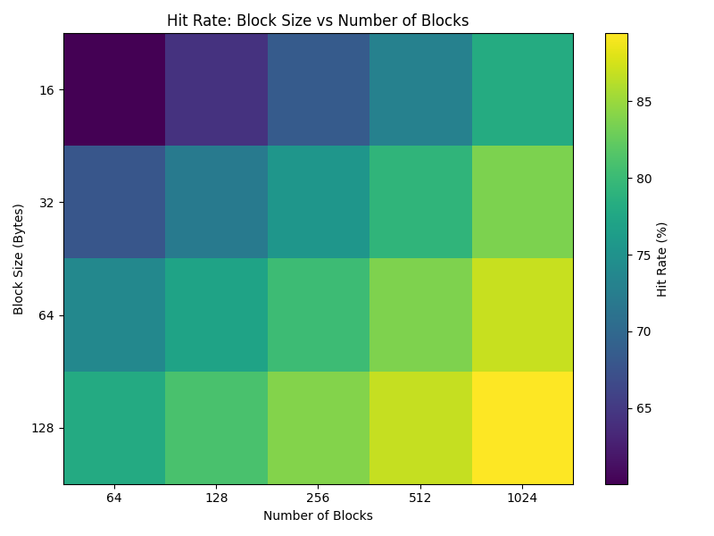
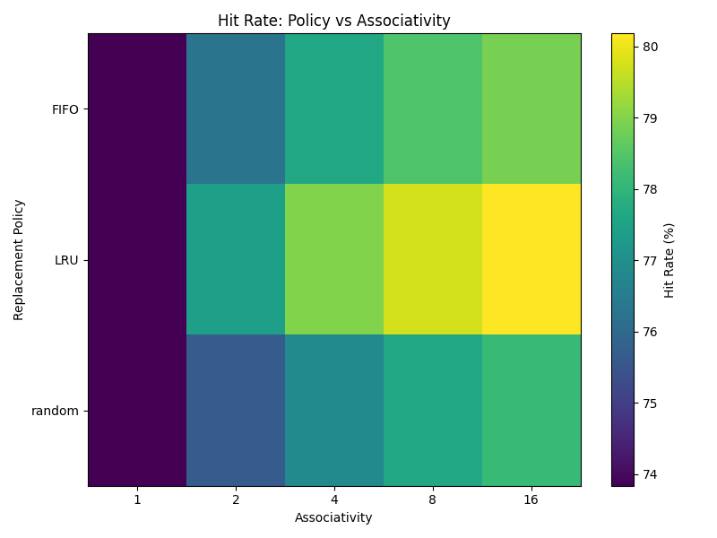

# CPU Cache Simulator


A configurable CPU cache simulator for architectural hardware performance evaluation. Supports direct-mapped, set-associative, and fully associative caches with LRU, FIFO, and Random replacement policies. Includes a parameter sweep framework that evaluates hundreds of configurations in a single run and auto-generates performance visualizations.

---

## Table of Contents

- [Background](#background)
- [Features](#features)
- [Installation](#installation)
- [Usage](#usage)
  - [Single Simulation](#single-simulation)
  - [Parameter Sweep](#parameter-sweep)
  - [Output Options](#output-options)
- [Results](#results)
- [Architecture](#architecture)
- [Future Work](#future-work)

---

## Background

The gap between CPU clock speeds and DRAM latency (the *memory wall*) means programs can be severely bottlenecked by memory access patterns regardless of core speed. Caches mitigate this by holding recently accessed data in a smaller, faster storage layer reachable in a handful of cycles.

This simulator models a unified L1-style cache and lets you measure how architectural choices such as capacity, associativity, block size, and replacement policy affect hit rate for a given memory access trace.

---

## Features

- **Placement policies:** Direct-mapped, N-way set-associative, fully associative
- **Replacement policies:** LRU, FIFO, Random
- **Parameter sweep mode:** Cartesian product of any combination of block sizes, block counts, associativities, and policies
- **Auto-visualization:** Nine Matplotlib plots and heatmaps saved to `docs/images/` on every sweep run
- **Export:** JSON and CSV output for both single runs and sweeps
- **Strict validation:** Power-of-two enforcement on all architectural parameters

---

## Installation

```bash
git clone https://github.com/matthewsam2/cache-simulator.git
cd cache-simulator
pip install -r requirements.txt
```

**Requirements:** `numpy`, `pandas`, `matplotlib`, `tqdm`

---

## Usage

Trace files are plain text with one hexadecimal address per line:

```
0x0001f4a0
0x0001f4a4
0x00020000
...
```

The trace file in the repository contains one million 32-bit hex addresses.

### Single Simulation

```bash
python cache_sim.py --datafile trace.txt
```

With explicit parameters:

```bash
python cache_sim.py \
  --datafile trace.txt \
  --block_size 64 \
  --num_blocks 256 \
  --associativity 4 \
  --replacement_policy LRU
```

Example output:

```
Configuration
-------------
Block Size        : 64
Number of Blocks  : 256
Associativity     : 4
Number of Sets    : 64
Replacement Policy: LRU

Cache Statistics
----------------
Accesses : 1000000
Hits     : 921443
Misses   : 78557
Hit Rate : 92.14%
Miss Rate: 7.86%
```

### Parameter Sweep

```bash
python cache_sim.py \
  --datafile trace.txt \
  --sweep \
  --sweep_block_sizes 16 32 64 128 \
  --sweep_num_blocks 64 128 256 512 \
  --sweep_associativities 1 2 4 8 16\
  --sweep_policies LRU FIFO RANDOM
```

Sweep output includes a ranked table of the top 10 configurations and identifies the single best-performing setup. Plots are automatically saved to `docs/images/`.

### Output Options

```bash
# Export single-run results
python cache_sim.py --datafile trace.txt --json_output results.json
python cache_sim.py --datafile trace.txt --csv_output results.csv

# Export sweep results
python cache_sim.py --datafile trace.txt --sweep --json_output sweep.json --csv_output sweep.csv
```

---

## Results

Plots below are generated automatically during a sweep run.

### Associativity vs Hit Rate


The largest gain comes from the 1-way to 2-way transition, where the worst conflict-miss pathologies are eliminated. Returns diminish at higher associativity values.

### Block Size vs Hit Rate


Performance peaks around 64 bytes, the standard L1 cache line size, before spatial-locality gains are offset by increased miss-transfer cost and pollution.

### Cache Capacity vs Hit Rate


Hit rate rises sub-linearly with capacity. Doubling from 64 to 128 blocks yields larger gains than from 256 to 512, as the working set fits comfortably at higher capacities.

### Hit Rate vs Block Size by Associativity



### Replacement Policy Comparison


LRU leads narrowly, followed by FIFO, then Random. The margin between LRU and Random closes significantly at high associativity where eviction decisions are less consequential.

### Heatmaps

| Associativity vs Block Size | Associativity vs Block Count |
|---|---|
|  |  |

| Block Size vs Block Count | Policy vs Associativity |
|---|---|
|  |  |

---

## Architecture

The simulator is organized around five dataclasses:

| Class | Role |
|---|---|
| `CacheConfig` | Architectural parameters + computed fields (`num_sets`, `offset_bits`, `index_bits`) |
| `CacheBlock` | Single cache line: tag, `last_used` (LRU), `insertion_time` (FIFO) |
| `CacheSet` | A set of blocks with per-set hit/miss counters |
| `CacheStats` | Aggregate hit/miss counts and rates across all sets |
| `SweepResult` | Configuration + metrics for one sweep combination |

### Address Decoding

A memory address is split into three bit fields:

```
[ tag | set index | block offset ]
      ↑           ↑
  index_bits   offset_bits = log₂(block_size)
```

```python
set_index = (address >> offset_bits) & ((1 << index_bits) - 1)
tag       = address >> (offset_bits + index_bits)
```

### Replacement Algorithms

All three policies operate on the `blocks` list of the target `CacheSet`:

- **LRU** — `min(blocks, key=lambda b: b.last_used)`
- **FIFO** — `min(blocks, key=lambda b: b.insertion_time)`
- **Random** — `random.randrange(len(blocks))`

---

## Future Work

- **Multi-level caches** — L1/L2/L3 hierarchy with inclusion/exclusion policies
- **Write policies** — write-through vs. write-back, write-allocate vs. no-write-allocate
- **Prefetching** — configurable stride prefetch engine
- **Parallel sweep** — `multiprocessing.Pool` to distribute configurations across CPU cores